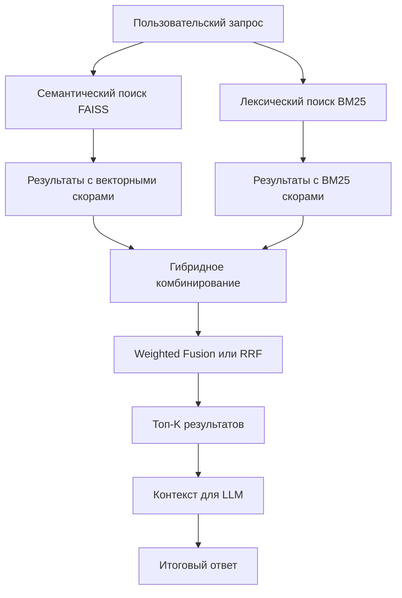

# Simple RAG с Гибридным Поиском 🔍

## Обзор

Этот проект представляет собой **продвинутый обучающий пример** реализации системы Retrieval-Augmented Generation (RAG) с **гибридным поиском** на Python. Проект создан для студентов и разработчиков, желающих изучить современные подходы к построению интеллектуальных поисковых систем, которые объединяют семантический и лексический поиск для достижения максимальной точности.

## Что такое RAG с Гибридным Поиском?

**RAG (Retrieval-Augmented Generation)** — это подход, при котором генерация текста языковой моделью улучшается за счёт предварительного поиска релевантной информации во внешней базе знаний.

**Гибридный поиск** — это инновационная техника, объединяющая:
- **Семантический поиск (FAISS)** — понимает смысл и контекст запроса
- **Лексический поиск (BM25)** — находит точные совпадения ключевых слов

### Преимущества гибридного подхода:

1. **Высокая точность** — объединение лучших качеств обоих методов поиска
2. **Устойчивость к синонимам** — семантический поиск понимает близкие по смыслу слова
3. **Точность терминологии** — лексический поиск находит специфические термины
4. **Настраиваемость** — возможность регулировать вклад каждого метода
5. **Актуальная информация** — без переобучения модели
6. **Снижение галлюцинаций** — ответы основаны на реальных данных

## Архитектура Гибридного Поиска



## Структура проекта

```
simple_rag/
│
├── configs/                    # 🔧 Конфигурационные файлы
│   ├── config.py              # Основные настройки системы
│   └── logger_config.py       # Настройка детального логирования
│
├── data/                      # 📂 База знаний (ваши документы)
│   ├── ai.md                  # Документы по искусственному интеллекту
│   └── rag.md                 # Документы по RAG-системам
│
├── data_preprocessing/        # 🔨 Обработка и подготовка данных
│   └── files_processing.py    # Загрузка и разбиение документов на чанки
│
├── model/                     # 🤖 Кэш предобученных моделей
│   └── models--ai-forever--FRIDA/  # Локально сохраненная модель эмбеддингов
│
├── notebooks/                 # 📓 Jupyter-ноутбуки с экспериментами
│
├── prompts/                   # 💬 Шаблоны для работы с LLM
│   └── llm_prompt.txt         # Основной промпт для генерации ответов
│
├── search/                    # 🔍 Ядро поисковой системы
│   ├── faiss_index.py         # Семантический поиск (векторные эмбеддинги)
│   ├── bm25_rerank.py         # Лексический поиск (статистический)
│   └── hybrid.py              # ⭐ ГИБРИДНЫЙ ПОИСК (объединение методов)
│
├── utils/                     # 🛠️ Вспомогательные утилиты
│   ├── llm_client.py          # Интерфейс для работы с языковыми моделями
│   ├── load_model_hf.py       # Загрузка моделей из Hugging Face
│   └── splitters.py           # Алгоритмы разбиения текста
│
├── main.py                    # 🚀 Главный файл запуска системы
├── requirements.txt           # 📦 Зависимости проекта
└── README.md                  # 📖 Документация (этот файл)
```

## Технологический стек

### Основные библиотеки:
- **🐍 Python** — основной язык программирования
- **🔍 FAISS** — высокоэффективный векторный поиск от Facebook AI
- **🤗 Sentence Transformers** — создание качественных эмбеддингов текста
- **📊 BM25S** — современная реализация алгоритма BM25 для лексического поиска
- **⚙️ Pydantic** — валидация конфигураций и типобезопасность
- **🌍 Python-dotenv** — управление переменными окружения
- **🔨 PyStemmer** — лингвистическая обработка текста

### Архитектурные компоненты:

#### 1. 🎯 **Семантический поиск (FAISS)**
- Преобразует тексты в высокоразмерные векторы
- Использует нейронные модели для понимания смысла
- Быстро находит семантически похожие документы
- Отлично работает с синонимами и парафразами

#### 2. 🎯 **Лексический поиск (BM25)**
- Статистический алгоритм на основе частоты слов
- Точно находит документы с конкретными терминами  
- Учитывает редкость слов и длину документов
- Идеален для технической терминологии

#### 3. 🎯 **Гибридное комбинирование**
- **Weighted Fusion**: настраиваемое взвешенное суммирование
- **RRF (Reciprocal Rank Fusion)**: комбинирование на основе позиций
- Нормализация скоров для справедливого объединения

## Начало работы

### Предварительные требования

- **Python 3.8+** (рекомендуется 3.10+)
- **8+ ГБ RAM** для работы с моделями эмбеддингов
- **Доступ к интернету** для загрузки моделей при первом запуске
- **Git** для клонирования репозитория

### Установка

1. **Клонируйте репозиторий:**
   ```bash
   git clone https://github.com/yourusername/simple_rag.git
   cd simple_rag
   ```

2. **Создайте изолированное виртуальное окружение:**
   ```bash
   python -m venv venv
   
   # Активация на Linux/Mac:
   source venv/bin/activate
   
   # Активация на Windows:
   venv\Scripts\activate
   ```

3. **Установите все зависимости:**
   ```bash
   pip install -r requirements.txt
   ```

4. **Настройте конфигурацию (опционально):**
   
   Создайте файл `.env` в корне проекта для кастомизации настроек:
   ```env
   # Размеры чанков для разбиения документов
   CHUNK_SIZE=1000
   CHUNK_OVERLAP=200
   
   # Параметры поиска
   FAISS_TOP_K=10
   BM25S_TOP_K=10
   FINAL_TOP_K=5
   
   # Настройка моделей
   MODEL_EMBEDDING=ai-forever/FRIDA
   ```

### Быстрый запуск

Запустите систему одной командой:
```bash
python main.py
```

После запуска вы увидите:
```
Введите ваш запрос: Что такое машинное обучение?
```

**Примеры запросов для тестирования:**
- "Объясни принципы работы нейронных сетей"
- "Какие алгоритмы используются в RAG?"
- "Преимущества и недостатки трансформеров"

## Как работает гибридная RAG-система

### Схема обработки запроса:

```
📝 Пользовательский запрос
    ↓
🔄 Параллельный поиск:
    ├── 🧠 FAISS (семантический) → Векторные скоры
    └── 📊 BM25 (лексический)   → Статистические скоры
    ↓
⚖️ Гибридное комбинирование:
    ├── Нормализация скоров [0,1]
    ├── Weighted: α×FAISS + (1-α)×BM25
    └── RRF: 1/(k+rank) суммирование
    ↓
🎯 Топ-K релевантных фрагментов
    ↓
🤖 Генерация ответа LLM с контекстом
    ↓
✅ Итоговый ответ пользователю
```

### Детальная схема работы:

#### 1. **Предварительная подготовка данных** (выполняется один раз):
   - 📂 **Загрузка документов** из директории `data/`
   - ✂️ **Разбиение на чанки** с помощью умных сплиттеров
   - 🔢 **Создание эмбеддингов** через модель ai-forever/FRIDA
   - 🗃️ **Индексация в FAISS** для быстрого векторного поиска
   - 📝 **Токенизация для BM25** с лемматизацией и удалением стоп-слов

#### 2. **Обработка запроса пользователя**:
   - 🧠 **Семантический поиск**: векторизация запроса → поиск ближайших эмбеддингов
   - 📊 **Лексический поиск**: токенизация запроса → BM25 скоринг документов
   - ⚖️ **Гибридное объединение**: нормализация + комбинирование скоров

#### 3. **Генерация финального ответа**:
   - 🎯 **Отбор топ-K** самых релевантных фрагментов
   - 🤖 **Формирование контекста** для языковой модели
   - ✍️ **Генерация ответа** на основе найденной информации


## Настройка гибридного поиска

### Параметры комбинирования методов:

#### **Weighted Fusion (Взвешенное объединение)**

```python
# В main.py
hybrid = HybridSearch(
    faiss_store=faiss_dm,
    bm25_engine=bm25_engine,
    method="weighted",
    alpha=0.6  # 60% семантика, 40% лексика
)
```

**Рекомендации по выбору alpha:**
- `α = 0.8-0.9` — для концептуальных, творческих запросов
- `α = 0.6-0.7` — универсальная настройка (рекомендуется)
- `α = 0.3-0.4` — для фактических, терминологических запросов
- `α = 0.1-0.2` — почти чистый лексический поиск

#### **RRF (Reciprocal Rank Fusion)**

```python
hybrid = HybridSearch(
    faiss_store=faiss_dm,
    bm25_engine=bm25_engine,
    method="rrf"  # Автоматическое комбинирование без настройки alpha
)
```

**Преимущества RRF:**
- Не требует настройки весов
- Устойчив к различиям в масштабах скоров
- Фокусируется на топовых результатах каждого метода

### Примеры оптимизации для разных задач:

```python
# Для научных текстов (много терминов)
hybrid_scientific = HybridSearch(
    faiss_store, bm25_engine, 
    alpha=0.4, top_k=10
)

# Для художественной литературы (семантика важнее)
hybrid_literature = HybridSearch(
    faiss_store, bm25_engine, 
    alpha=0.8, top_k=5
)

# Универсальная настройка с RRF
hybrid_universal = HybridSearch(
    faiss_store, bm25_engine, 
    method="rrf", top_k=7
)
```

## Часто задаваемые вопросы

### ⚡ **Производительность и требования**

**Q: Какие минимальные системные требования?**
A: 
- **CPU**: любой современный процессор
- **RAM**: 8 ГБ минимум, 16 ГБ рекомендуется  
- **Диск**: 2-5 ГБ для моделей и индексов
- **GPU**: не обязателен, но ускорит создание эмбеддингов

**Q: Насколько быстро работает поиск?**
A:
- **Первый запуск**: 30-60 секунд (загрузка моделей, создание индексов)
- **Последующие запросы**: 0.1-1 секунда
- **Масштабируемость**: до 100K документов без проблем

### 🤖 **Модели и данные**

**Q: Можно ли использовать другие модели эмбеддингов?**
A: Да! Измените `MODEL_EMBEDDING` в настройках. Поддерживаются все модели Sentence Transformers.

**Q: Поддерживаются ли документы на других языках?**
A: Да, но нужна соответствующая модель. Для английского используйте `all-MiniLM-L6-v2`, для многоязычных — `paraphrase-multilingual-MiniLM-L12-v2`.

**Q: Как добавить поддержку PDF, DOCX файлов?**
A: Установите дополнительные библиотеки:
```bash
pip install PyPDF2 python-docx
```
И обновите `data_preprocessing/files_processing.py`.

### 🔧 **Настройка и оптимизация**

**Q: Как выбрать оптимальные параметры alpha?**
A: 
- Начните с `alpha=0.6` (универсальная настройка)
- Для технических текстов уменьшите до `0.3-0.4`
- Для творческих/концептуальных увеличьте до `0.7-0.8`
- Используйте A/B тестирование на ваших данных

**Q: Weighted или RRF — что лучше?**
A:
- **Weighted**: когда вы понимаете специфику ваших данных
- **RRF**: для универсального использования без настройки
- **RRF**: когда скоры FAISS и BM25 сильно различаются

**Q: Система работает медленно, как ускорить?**
A:
1. Уменьшите `CHUNK_SIZE` и `FAISS_TOP_K`, `BM25S_TOP_K`
2. Используйте более легкую модель эмбеддингов
3. Добавьте GPU для ускорения векторизации
4. Кэшируйте результаты частых запросов

### 🚀 **Развертывание и интеграция**

**Q: Можно ли запустить это в продакшене?**
A: Текущая версия — обучающая. Для продакшена нужно:
- Добавить API интерфейс (FastAPI/Flask)
- Настроить мониторинг и логирование
- Добавить кэширование результатов
- Реализовать асинхронную обработку

**Q: Как интегрировать с веб-приложением?**
A: Создайте REST API обертку:
```python
from fastapi import FastAPI
app = FastAPI()

@app.post("/search")
async def search_endpoint(query: str):
    results = hybrid.search(query)
    return {"results": results}
```

### 🐛 **Устранение проблем**

**Q: Ошибка "Model not found" при первом запуске**
A: Это нормально. Модель загружается из интернета при первом использовании. Подождите завершения загрузки.

**Q: Некачественные результаты поиска**
A: 
1. Проверьте качество исходных данных в `data/`
2. Настройте параметры разбиения (`CHUNK_SIZE`, `CHUNK_OVERLAP`)
3. Поэкспериментируйте с параметром `alpha`
4. Попробуйте другую модель эмбеддингов

**Q: Ошибка памяти при работе с большими документами**
A:
1. Уменьшите `CHUNK_SIZE`
2. Обрабатывайте файлы по частям
3. Используйте более легкую модель эмбеддингов
4. Увеличьте RAM или используйте swap

## Расширение функциональности

### 🔧 **Добавление собственных данных**

1. **Поместите документы** в директорию `data/`:
   ```
   data/
   ├── your_domain_docs.md
   ├── technical_specs.pdf  # Планируется поддержка
   └── knowledge_base.txt
   ```

2. **Система автоматически**:
   - Обнаружит новые файлы
   - Разобьет их на оптимальные чанки
   - Создаст новые эмбеддинги
   - Обновит индексы поиска

### 🤖 **Экспериментирование с моделями**

```python
# В utils/load_model_hf.py можно легко заменить модель
AVAILABLE_MODELS = [
    "ai-forever/FRIDA",           # Русскоязычная (по умолчанию)
    "sentence-transformers/all-MiniLM-L6-v2",  # Английская, быстрая
    "sentence-transformers/all-mpnet-base-v2", # Английская, точная
    "cointegrated/rubert-tiny2",  # Русская, компактная
]
```

### ⚙️ **Тонкая настройка параметров**

**В файле `configs/config.py`:**

```python
# Размеры чанков
CHUNK_SIZE = 1000        # Больше = больше контекста, медленнее
CHUNK_OVERLAP = 200      # Перекрытие для связности

# Параметры поиска
FAISS_TOP_K = 15         # Кандидатов от семантического поиска
BM25S_TOP_K = 15         # Кандидатов от лексического поиска  
FINAL_TOP_K = 5          # Итоговых результатов для LLM
```

**BM25 параметры (продвинутая настройка):**
```python
# В search/bm25_rerank.py
bm25 = BM25S(
    chunks=chunks,
    k1=1.2,      # Влияние частоты термина (0.0-3.0)
    b=0.75,      # Нормализация длины документа (0.0-1.0)
    delta=1.0    # Для BM25+ варианта
)
```

### 🌐 **Интеграция с LLM провайдерами**

Система готова к интеграции с:
- **OpenAI GPT** (через API)
- **Anthropic Claude** (через API)  
- **Локальные модели** (Ollama, vLLM)
- **Hugging Face** (локальные трансформеры)

```python
# Пример в utils/llm_client.py
def ask_llm(prompt: str, bm25_results: str) -> str:
    # Здесь можно подключить любого LLM провайдера
    # OpenAI, Anthropic, локальные модели и т.д.
    pass
```

## Обучающие материалы и примеры

### 📚 **Для изучения алгоритмов**

Каждый модуль содержит подробные комментарии и docstring:

```python
# search/hybrid.py - детально прокомментирован для студентов
class HybridSearch:
    """
    Объединяет семантический и лексический поиск.
    Содержит примеры использования и технические детали.
    """
```

### 🧪 **Примеры экспериментов**

1. **Сравнение методов поиска:**
   ```bash
   # Тестируйте разные запросы и наблюдайте разницу:
   python main.py
   
   # Попробуйте:
   > "deep learning нейронные сети"     # Семантика + ключевые слова
   > "определение машинного обучения"   # Концептуальный запрос
   > "backpropagation algorithm 1986"   # Фактический запрос
   ```

2. **A/B тестирование методов:**
   ```python
   # Сравните weighted vs RRF
   results_weighted = hybrid_weighted.search(query)
   results_rrf = hybrid_rrf.search(query)
   ```

### 📊 **Метрики и анализ качества**

**Логирование для анализа:**
- Детальные логи работы каждого компонента
- Скоры от FAISS и BM25 для анализа
- Время выполнения каждого этапа

**Планируемые метрики:**
- NDCG (Normalized Discounted Cumulative Gain)
- MRR (Mean Reciprocal Rank)  
- Hit Rate для топ-K результатов

### 🎯 **Практические задания для студентов**

1. **Новичок**: Добавить свои документы и протестировать систему
2. **Средний**: Настроить параметры alpha для своей предметной области
3. **Продвинутый**: Реализовать новый метод комбинирования результатов
4. **Эксперт**: Добавить метрики качества и A/B тестирование

## Дорожная карта развития 🗺️

### В ближайших обновлениях:

#### 🚀 **v2.0 - Веб-интерфейс**
- [ ] REST API на FastAPI
- [ ] Веб-интерфейс для удобного тестирования
- [ ] Загрузка документов через браузер
- [ ] Визуализация результатов поиска

#### 📊 **v2.1 - Аналитика и метрики**
- [ ] Система оценки качества результатов
- [ ] A/B тестирование разных конфигураций
- [ ] Дашборд с метриками производительности
- [ ] Экспорт результатов в различных форматах

#### 🔧 **v2.2 - Расширенная функциональность**
- [ ] Поддержка PDF, DOCX, HTML документов
- [ ] Интеграция с популярными LLM API (OpenAI, Anthropic)
- [ ] Кэширование результатов поиска
- [ ] Асинхронная обработка больших коллекций

#### 🎯 **v3.0 - Продвинутые алгоритмы**
- [ ] ColBERT для еще более точного семантического поиска
- [ ] Переранжирование с помощью Cross-Encoder моделей
- [ ] Поддержка многоязычных коллекций
- [ ] Автоматическая настройка гиперпараметров

---

## Благодарности 🙏

Этот проект создан для образовательных целей и вдохновлен лучшими практиками в области Information Retrieval и RAG-систем.

**Использованные технологии:**
- [FAISS](https://github.com/facebookresearch/faiss) - Facebook AI Similarity Search
- [Sentence Transformers](https://www.sbert.net/) - семантические эмбеддинги
- [BM25S](https://github.com/xhluca/bm25s) - современная реализация BM25
- [ai-forever/FRIDA](https://huggingface.co/ai-forever/FRIDA) - русскоязычная модель эмбеддингов

**Вклад в проект приветствуется!** 
Создавайте Issues для обсуждения улучшений или отправляйте Pull Requests с новой функциональностью.

---

## Лицензия 📄

Этот проект распространяется под лицензией MIT. Вы можете свободно использовать, изменять и распространять код в образовательных и коммерческих целях.

**Автор**: [Ваше имя]  
**Контакты**: [ваш email]  
**GitHub**: [ссылка на репозиторий]

---

*Если этот проект оказался полезным для вашего обучения, поставьте ⭐ на GitHub!*

